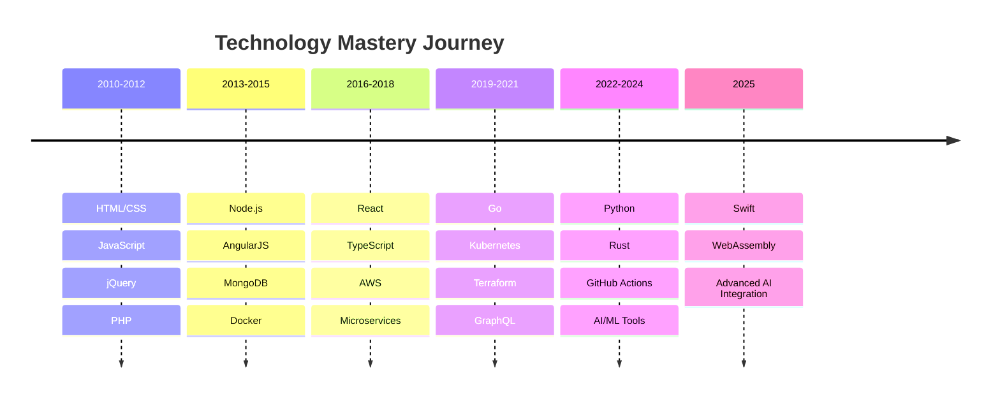

<!-- markdownlint-disable -->

# 🛠️ Technology Stack & Skills

## Core Technologies

### Programming Languages

  

### Frameworks & Libraries

### Development Tools & Platforms

   

### Cloud & Infrastructure

## 🎯 Skill Matrix & Proficiency Levels

<table align="center">
<tr>
<td colspan="4">

### **Proficiency Legend**

🟢 **Expert** (5+ years) • 🔵 **Advanced** (3-5 years) • 🟡 **Intermediate** (1-3 years) • ⚪ **Learning** (<1 year)

</td>
</tr>
<tr>
<th width="25%">Languages</th>
<th width="25%">Frameworks</th>
<th width="25%">Tools & DevOps</th>
<th width="25%">Platforms & Cloud</th>
</tr>
<tr>
<td valign="top">

🟢 **TypeScript**  🟢 **JavaScript**  🔵 **Python**  🔵 **Go**  🟡 **Rust**  ⚪ **Swift** 

</td>
<td valign="top">

🟢 **React**  🟢 **Node.js**  🔵 **Next.js**  🔵 **Express**  🟡 **FastAPI**  🟡 **Gin** 

</td>
<td valign="top">

🟢 **Docker**  🟢 **Git**  🟢 **GitHub Actions**  🔵 **Kubernetes**  🔵 **Terraform**  🟡 **Helm** 

</td>
<td valign="top">

🟢 **AWS**  🔵 **Azure**  🔵 **Vercel**  🟡 **Google Cloud**  🟡 **DigitalOcean**  ⚪ **Railway** 

</td>
</tr>
</table>

## 📈 Technology Adoption Timeline

## 🔥 Currently Trending & Learning

### 🚀 Active Focus Areas (2025)

| Technology | Use Case | Learning Progress |
| :-: | :-: | :-: |
|  | iOS Development | 🟡 **Building first apps** |
|  | Performance Optimization | ⚪ **Experimental phase** |
|  | Systems Programming | 🟡 **CLI tools & backends** |
|  | Developer Tooling | 🔵 **Integration projects** |

### 🎯 Next on the Roadmap

- **Edge Computing** with Cloudflare Workers & Deno Deploy
- **Advanced DevOps** with GitOps and ArgoCD
- **Mobile Development** expanding React Native skills
- **AI-Powered Development** tools and automation

## 💪 Expertise Highlights

### Technical Leadership

🏗️ **Architecture Design** • 🚀 **Scalability Planning** • 👥 **Team Mentoring** • 📚 **Technical Writing**

### Open Source Contributions

🔧 **Developer Tools** • 📦 **Package Maintenance** • 🤝 **Community Building** • 📋 **Project Management**

### Industry Experience

💼 **Enterprise Solutions** • ⚡ **Performance Optimization** • 🔒 **Security Implementation** • 📊 **Data Engineering**

---

        

_Badge data automatically updated every 6 hours via GitHub Actions_

<!-- markdownlint-restore -->
