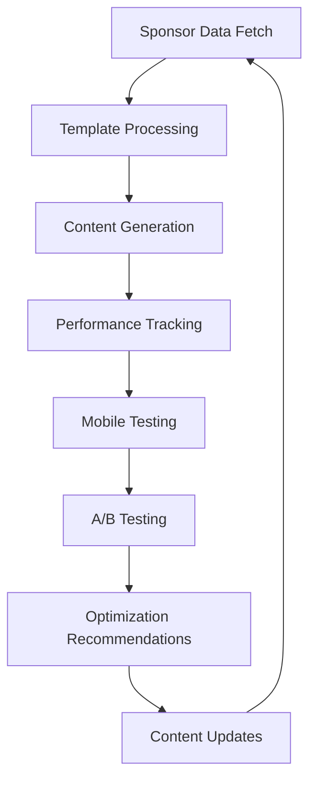

# Conversion Optimization & Performance Measurement

This document provides comprehensive guidance for ongoing content maintenance and optimization procedures for the GitHub sponsors pitch optimization system.

## Overview

The sponsors pitch optimization system implements data-driven content improvement through:

- **Performance Tracking**: Automated metrics collection and sponsor acquisition monitoring
- **A/B Testing Framework**: Content variation testing and optimization
- **Mobile Responsiveness**: Cross-device compatibility and readability optimization
- **Iterative Improvement**: Continuous optimization based on performance data

## System Architecture

### Core Components

```text
📁 Core System Components
├── 📄 templates/SPONSORME.tpl.md           # Main sponsor pitch template
├── 📄 templates/variants/                  # A/B testing variations
├── 📄 scripts/content-performance-tracking.ts  # Performance measurement
├── 📄 scripts/update-sponsors.ts           # Template processing with tracking
├── 📄 scripts/mobile-responsiveness-tester.ts  # Mobile optimization testing
├── 📄 scripts/ab-testing-framework.ts      # A/B testing management
└── 📁 .cache/performance/                  # Performance data storage
```

### Data Flow



## Daily Maintenance Procedures

### 1. Automated Data Collection

**Frequency**: Every 6 hours (via GitHub Actions)

```bash
# Fetch latest sponsor data
pnpm sponsors:fetch

# Update sponsor content with performance tracking
pnpm sponsors:update

# Test mobile responsiveness
pnpm mobile:test
```

**What to Monitor**:

- Sponsor acquisition/loss notifications
- Performance metric changes
- Mobile optimization scores
- Critical issues or regressions

### 2. Weekly Performance Review

**Frequency**: Every Monday

```bash
# Generate comprehensive performance report
pnpm content:track --report 7

# Review mobile test results
pnpm mobile:test --report

# Check A/B testing progress
pnpm ab-test status
```

**Key Metrics to Review**:

- Conversion rate trends
- Sponsor acquisition velocity
- Mobile optimization scores
- A/B testing results

### 3. Monthly Optimization Cycle

**Frequency**: First Monday of each month

```bash
# Generate monthly performance report
pnpm content:track --report 30

# Export data for analysis
pnpm content:track --export csv

# Review and plan A/B testing variants
pnpm ab-test plan
```

## Performance Metrics Guide

### Key Performance Indicators (KPIs)

| Metric                | Target Range  | Description                           |
| --------------------- | ------------- | ------------------------------------- |
| **Conversion Rate**   | 2-5%          | Profile views to sponsor acquisitions |
| **Mobile Score**      | 80-100        | Mobile responsiveness and readability |
| **Growth Rate**       | 5-15% monthly | Monthly funding growth percentage     |
| **Sponsor Retention** | >90%          | Monthly sponsor retention rate        |

### Metric Interpretation

#### Conversion Rate

```bash
# Check current conversion rate
pnpm content:track --metrics 30
```

- **Below 1%**: Critical - review messaging and CTAs
- **1-2%**: Poor - consider A/B testing new approaches
- **2-5%**: Good - maintain current strategy
- **Above 5%**: Excellent - document successful elements

#### Mobile Optimization Score

```bash
# Test mobile responsiveness
pnpm mobile:test
```

- **Below 60**: Critical - immediate mobile optimization needed
- **60-79**: Needs improvement - address flagged issues
- **80-89**: Good - minor optimizations recommended
- **90-100**: Excellent - maintain current approach

#### Growth Rate

```bash
# Check growth trends
pnpm content:track --report 30
```

- **Negative**: Critical - analyze recent changes and market factors
- **0-2%**: Poor - consider content refresh or new strategies
- **3-10%**: Good - steady growth trajectory
- **Above 10%**: Excellent - maintain successful strategies

## A/B Testing Procedures

### Planning A/B Tests

**Monthly Planning Process**:

1. **Hypothesis Formation**

   ```bash
   # Review current performance
   pnpm content:track --report 30

   # Identify improvement opportunities
   # - Low conversion rates
   # - Mobile optimization issues
   # - Competitor analysis insights
   ```

2. **Test Design**

   ```bash
   # Create test variant
   pnpm ab-test create --name "cta-urgency" --description "Test urgency in CTAs"

   # Configure test parameters
   # - Traffic split (usually 50/50)
   # - Duration (minimum 2 weeks)
   # - Success metrics
   ```

3. **Implementation**

   ```bash
   # Start A/B test
   pnpm ab-test start cta-urgency

   # Monitor test progress
   pnpm ab-test status cta-urgency
   ```

### Test Categories

#### 1. Headline and Value Proposition Tests

- **Test Elements**: Main headline, subheadings, value statements
- **Success Metrics**: Profile views, time on page, scroll depth
- **Duration**: 2-4 weeks

#### 2. Call-to-Action (CTA) Tests

- **Test Elements**: Button text, placement, urgency language
- **Success Metrics**: Click-through rate, sponsor acquisitions
- **Duration**: 1-2 weeks

#### 3. Social Proof Tests

- **Test Elements**: Testimonials, sponsor count display, achievement highlighting
- **Success Metrics**: Conversion rate, average contribution amount
- **Duration**: 3-4 weeks

#### 4. Content Structure Tests

- **Test Elements**: Section order, paragraph length, bullet point usage
- **Success Metrics**: Mobile score, readability metrics, completion rate
- **Duration**: 2-3 weeks

### Running Tests

```bash
# List active tests
pnpm ab-test list

# Get detailed test results
pnpm ab-test results test-name

# Stop test and implement winner
pnpm ab-test stop test-name --implement-winner
```

## Optimization Workflows

### 1. Performance Decline Response

**Trigger**: Conversion rate drops >20% or mobile score <70

**Immediate Actions**:

```bash
# 1. Analyze recent changes
pnpm content:track --report 7

# 2. Check mobile optimization
pnpm mobile:test

# 3. Review sponsor feedback
# Check GitHub issues and direct feedback

# 4. Rollback if necessary
git log --oneline -10
git revert <commit-hash>  # If needed
```

**Investigation Process**:

1. Compare with previous high-performing periods
2. Analyze external factors (market changes, competitor actions)
3. Review A/B testing results for insights
4. Plan corrective A/B tests

### 2. Continuous Improvement Process

**Monthly Optimization Cycle**:

```bash
# Week 1: Analysis and Planning
pnpm content:track --report 30
pnpm mobile:test --report
# Plan A/B tests based on insights

# Week 2-3: A/B Testing
# Run planned tests
pnpm ab-test status  # Monitor progress

# Week 4: Implementation and Review
# Implement winning variations
# Document learnings and plan next cycle
```

## Content Maintenance Standards

### Template Quality Guidelines

#### 1. Mobile-First Approach

- **Line Length**: Maximum 80 characters for mobile readability
- **Paragraph Length**: 15-50 words for optimal mobile scanning
- **Heading Structure**: Clear H1-H3 hierarchy for navigation
- **Link Density**: 1-5% of total content for optimal UX

#### 2. Conversion Optimization

- **Value Proposition**: Clear benefit statement in first 100 words
- **Social Proof**: Sponsor count and testimonials prominently displayed
- **Call-to-Action**: Multiple CTAs with different urgency levels
- **Objection Handling**: Address common sponsor concerns

#### 3. Content Freshness

- **Update Frequency**: Template review every 3 months
- **Dynamic Content**: Automated sponsor data updates every 6 hours
- **Seasonal Adjustments**: Quarterly messaging updates for market changes
- **Competitive Analysis**: Monthly review of successful sponsor profiles

### Quality Assurance Checklist

**Before Publishing**:

- [ ] Mobile responsiveness score >80
- [ ] All dynamic placeholders working
- [ ] No broken links or formatting issues
- [ ] A/B testing framework functional
- [ ] Performance tracking active

**Weekly Review**:

- [ ] Conversion rate within target range
- [ ] No critical mobile issues
- [ ] A/B tests running as planned
- [ ] Sponsor data updating correctly
- [ ] Performance insights generated

**Monthly Assessment**:

- [ ] Overall growth trending positive
- [ ] Mobile optimization maintained
- [ ] A/B testing insights documented
- [ ] Competitive positioning reviewed
- [ ] Content freshness evaluation

## Troubleshooting Guide

### Common Issues and Solutions

#### 1. Performance Tracking Not Working

```bash
# Check cache directory permissions
ls -la .cache/performance/

# Reinitialize performance tracker
pnpm content:track --help
rm -rf .cache/performance/  # Clear cache
pnpm content:track --report 1  # Regenerate
```

#### 2. Mobile Test Failures

```bash
# Test specific breakpoints
pnpm mobile:test --report

# Check template syntax
markdownlint-cli2 templates/SPONSORME.tpl.md

# Validate generated content
pnpm mobile:test SPONSORME.md
```

#### 3. A/B Testing Issues

```bash
# Check test configuration
pnpm ab-test list
pnpm ab-test status test-name

# Validate test variants
ls -la templates/variants/

# Reset testing framework if needed
pnpm ab-test reset --confirm
```

#### 4. Sponsor Data Problems

```bash
# Refresh sponsor data
GITHUB_TOKEN=$(gh auth token) pnpm sponsors:fetch --force-refresh

# Check cache validity
cat .cache/sponsors-data.json | jq '.success'

# Fallback to backup data
cp .cache/sponsors-data-backup.json .cache/sponsors-data.json
```

### Performance Monitoring Alerts

**Critical Alerts** (Immediate Action Required):

- Conversion rate drops >30% week-over-week
- Mobile optimization score <60
- Sponsor data fetch failures >24 hours
- A/B testing framework errors

**Warning Alerts** (Review Within 48 Hours):

- Conversion rate drops 15-30% week-over-week
- Mobile optimization score 60-79
- Growth rate negative for 2+ weeks
- A/B testing statistical significance not reached

## Best Practices

### Content Development

1. **Data-Driven Decisions**: Base all changes on performance metrics and A/B test results
2. **Mobile-First Design**: Optimize for mobile experience before desktop
3. **Iterative Improvement**: Make small, measurable changes rather than major overhauls
4. **User-Centric Approach**: Focus on sponsor benefits and value rather than features

### Testing Strategy

1. **Single Variable Testing**: Test one element at a time for clear insights
2. **Statistical Significance**: Run tests for minimum 2 weeks or 100+ conversions
3. **Seasonal Considerations**: Account for monthly/quarterly funding patterns
4. **Document Everything**: Record all test hypotheses, results, and learnings

### Performance Optimization

1. **Regular Monitoring**: Check key metrics weekly, detailed analysis monthly
2. **Proactive Optimization**: Don't wait for problems to optimize
3. **Competitive Analysis**: Monthly review of successful sponsor profiles
4. **Continuous Learning**: Stay updated on fundraising and conversion best practices

## Resources and References

### Internal Documentation

- [Sponsors Tracking System](../types/sponsors.ts)
- [A/B Testing Framework](../scripts/ab-testing-framework.ts)
- [Mobile Testing Guide](../scripts/mobile-responsiveness-tester.ts)

### External Resources

- [GitHub Sponsors Documentation](https://docs.github.com/en/sponsors)
- [Conversion Rate Optimization Guide](https://blog.hubspot.com/marketing/conversion-rate-optimization-guide)
- [Mobile-First Design Principles](https://developers.google.com/web/fundamentals/design-and-ux/responsive)
- [A/B Testing Best Practices](https://blog.optimizely.com/2020/01/23/ab-testing-best-practices/)

### Support Contacts

- **Technical Issues**: Create GitHub issue in repository
- **Performance Questions**: Review performance tracking documentation
- **Content Strategy**: Refer to copywriting guidelines and research documentation

---

**Last Updated**: 2025-08-17 **Version**: 1.0 **Next Review**: 2025-09-17
